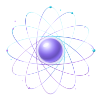

# 🎨 Kit de marca — Mess

Todo lo necesario para aplicar la identidad visual de **Mess · Software de Gestión** en
**otra app**. Este archivo está pensado para pasárselo tal cual a Claude en el otro
proyecto: tiene los colores exactos, los archivos y el código listo para copiar.

**El producto es Mess.** Cada empresa que lo usa (RK, y las que se sumen) mantiene su
propia identidad adentro del sistema: Mess es el software, no la empresa cliente.

---

## 1. Archivos

| Archivo | Para qué |
|---|---|
| `assets/mess-logo.svg` | Logo principal. Fondo transparente, escala a cualquier tamaño. Para el splash, el login y encabezados. |
| `assets/mess-icon.svg` | Ícono con fondo (espacio profundo), *maskable*. Para la PWA. |
| `assets/mess-icon-192.png` | Ícono PWA 192×192. |
| `assets/mess-icon-512.png` | Ícono PWA 512×512. |

**Diferencia importante:** el *logo* es transparente y se usa sobre cualquier fondo; el
*ícono* trae fondo propio y sirve para el ícono instalado del teléfono.

---

## 2. Paleta

| Color | Hex | Uso |
|---|---|---|
| Violeta | `#7C5CFF` | Principal. Botones, acentos, enlaces. |
| Cian | `#22D3EE` | Secundario. Detalles, estados activos, nodos. |
| Lila | `#C084FC` | Terciario. Degradados y toques suaves. |
| Violeta claro | `#9E86FF` | Esfera del logo (medio). |
| Violeta profundo | `#6D4BE0` | Esfera del logo (borde). |
| Casi blanco | `#EAE4FF` | Textos sobre fondo oscuro. |

**Fondos oscuros** (el logo está pensado para fondo oscuro):

| Color | Hex |
|---|---|
| Fondo base | `#0A0D14` |
| Panel / tarjeta | `#141926` |
| Borde de panel | `#252D42` |

**Degradado de marca** (el de las órbitas del logo):

```css
background: linear-gradient(90deg, #22D3EE, #7C5CFF 55%, #C084FC);
```

---

## 3. Cómo ponerlo en otra app

### Opción A — copiar el archivo (lo más simple)

1. Copiá `assets/mess-logo.svg` a la carpeta de la otra app.
2. Usalo como cualquier imagen:

```html

```

### Opción B — pegar el SVG dentro del HTML

Sirve si no querés manejar archivos sueltos, o si querés animar las órbitas.
Abrí `assets/mess-logo.svg`, copiá **todo** el contenido y pegalo directo en el HTML.
Queda como un `<svg>` más y no necesita ningún archivo externo.

> Si pegás el SVG en una página donde ya hay otro SVG, revisá que los `id` de los
> degradados (`messSphere`, `messOrbit`, `messGlow`) no se repitan: si dos SVG usan el
> mismo `id`, el navegador mezcla los degradados y se ve mal.

### El logo ya se mueve solo

**No hace falta agregar nada.** La animación está *dentro* del SVG: las órbitas giran
lento, los nodos giran al revés más lento todavía, y la esfera late suave.

Está hecha con **SMIL** (`<animateTransform>`), no con CSS, y eso es a propósito: cuando
un SVG se usa como ``, el navegador **no ejecuta las animaciones CSS
internas**, pero **sí las SMIL**. Con CSS el logo se movía sólo si se pegaba el SVG
dentro del HTML; con SMIL se mueve en los dos casos, sin JavaScript.

Si en algún lugar lo querés **quieto** (por ejemplo, en un PDF o un mail), usá el PNG del
ícono en vez del SVG.

### Íconos de la PWA

Reemplazá los íconos de la otra app por estos y listo:

```
assets/mess-icon-192.png  →  icons/icon-192.png
assets/mess-icon-512.png  →  icons/icon-512.png
```

En el `manifest.json` conviene que estén como `"purpose": "any maskable"`, porque el
ícono ya trae margen de seguridad para que Android no recorte la galaxia.

---

## 4. Sistema de marca por configuración (opcional)

Si la otra app también va a tener marca configurable, se puede copiar el mismo mecanismo
que usa este sistema: un solo archivo `config.js` con un bloque `brand`, y el resto del
código lee de ahí.

```js
window.APP_CONFIG = {
  brand: {
    nombre: "Mess · Software de Gestión",  // título y presentación
    nombreCorto: "Mess",                   // nombre de la app instalada
    siglas: "Ms",                          // el anillo del login
    tagline: "Software de Gestión",
    razonSocial: "Mess",                   // el PRODUCTO, no la empresa cliente
    asistente: "Asistente Mess",
    logo: "assets/mess-logo.svg"
  }
};
```

Ver `MULTIEMPRESA.md` y `CLONAR.md` para el mecanismo completo.

> ⚠️ **Ojo con `razonSocial`.** Describe al producto, pero se usa como respaldo del nombre
> que sale impreso en los recibos cuando todavía no se eligió una empresa. Con una empresa
> seleccionada se imprime el nombre de ESA empresa, no este campo.

> ⚠️ **La marca guardada pisa a `config.js`.** Si alguien guardó la marca desde la app
> (Config → 🎨 Marca), ese valor queda en Firebase y en `localStorage` y **tiene prioridad
> sobre el archivo**. Si cambiás `config.js` y no ves el cambio, es por esto: se limpia con
> el botón **Restablecer** de esa misma pantalla.

---

## 5. El logo en código (para pegar directo)

claude.ai **no acepta archivos `.svg` como adjunto**. Por eso el logo va acá adentro:
copiá todo el bloque de abajo y pegalo como `assets/mess-logo.svg` en la otra app, o
directamente dentro del HTML.

Ya viene animado (las órbitas giran). No hay que agregar CSS ni JavaScript.

```xml
<svg xmlns="http://www.w3.org/2000/svg" viewBox="0 0 200 200" width="200" height="200" role="img" aria-label="Mess">
  <defs>
    <!-- Esfera metalizada: el salto brusco de claro a oscuro (no un degradado suave)
         es lo que el ojo lee como metal pulido, en vez de plástico. -->
    <radialGradient id="messSphere" cx="34%" cy="28%" r="78%">
      <stop offset="0%"   stop-color="#FFFFFF"/>
      <stop offset="14%"  stop-color="#E3DCFF"/>
      <stop offset="30%"  stop-color="#A896FF"/>
      <stop offset="52%"  stop-color="#6D4BE0"/>
      <stop offset="72%"  stop-color="#4A2FA8"/>
      <stop offset="88%"  stop-color="#7C5CFF"/>
      <stop offset="100%" stop-color="#3A2596"/>
    </radialGradient>
    <!-- Órbitas metalizadas: se mantienen los colores de marca (cian → violeta → lila)
         pero alternando bandas de brillo y sombra del mismo tono. Esa alternancia es
         lo que da el aspecto de metal; un degradado liso se ve plano. -->
    <linearGradient id="messOrbit" x1="0" y1="0" x2="1" y2="1">
      <stop offset="0%"   stop-color="#0E7490"/>
      <stop offset="9%"   stop-color="#22D3EE"/>
      <stop offset="17%"  stop-color="#E0FBFF"/>
      <stop offset="26%"  stop-color="#22D3EE"/>
      <stop offset="38%"  stop-color="#3B5BD0"/>
      <stop offset="50%"  stop-color="#7C5CFF"/>
      <stop offset="58%"  stop-color="#F0EBFF"/>
      <stop offset="67%"  stop-color="#7C5CFF"/>
      <stop offset="78%"  stop-color="#7A3FB8"/>
      <stop offset="88%"  stop-color="#C084FC"/>
      <stop offset="95%"  stop-color="#FBF0FF"/>
      <stop offset="100%" stop-color="#8B45C4"/>
    </linearGradient>
    <!-- Los nodos también metalizados, para que no queden como puntos planos. -->
    <radialGradient id="messNodoCian" cx="35%" cy="30%" r="75%">
      <stop offset="0%"   stop-color="#FFFFFF"/>
      <stop offset="40%"  stop-color="#22D3EE"/>
      <stop offset="100%" stop-color="#0E7490"/>
    </radialGradient>
    <radialGradient id="messNodoLila" cx="35%" cy="30%" r="75%">
      <stop offset="0%"   stop-color="#FFFFFF"/>
      <stop offset="40%"  stop-color="#C084FC"/>
      <stop offset="100%" stop-color="#7A3FB8"/>
    </radialGradient>
    <filter id="messGlow" x="-60%" y="-60%" width="220%" height="220%">
      <feGaussianBlur stdDeviation="3" result="b"/>
      <feMerge><feMergeNode in="b"/><feMergeNode in="SourceGraphic"/></feMerge>
    </filter>
    <!-- El movimiento se hace con animación SMIL (<animateTransform>), no con CSS.
         Motivo: cuando el logo se usa como  —que es como lo
         usa la presentación— el navegador NO ejecuta las animaciones CSS internas,
         pero SÍ las SMIL. Así el logo se mueve en cualquier lado, sin JavaScript y
         sin tener que tocar el código de la app que lo muestra. -->
  </defs>

  <!-- Campo de estrellas (galaxia) -->
  <g fill="#C084FC">
    <circle cx="30" cy="42" r="1.3" opacity="0.75"/>
    <circle cx="168" cy="54" r="1" opacity="0.65"/>
    <circle cx="176" cy="150" r="1.3" opacity="0.7"/>
    <circle cx="44" cy="160" r="0.9" opacity="0.6"/>
    <circle cx="150" cy="176" r="1.1" opacity="0.55"/>
  </g>
  <g fill="#22D3EE">
    <circle cx="22" cy="118" r="1" opacity="0.65"/>
    <circle cx="120" cy="20" r="1.2" opacity="0.7"/>
    <circle cx="182" cy="96" r="0.9" opacity="0.55"/>
  </g>

  <!-- Órbitas: giran lento, como una galaxia -->
  <g fill="none" stroke="url(#messOrbit)" stroke-width="0.8" stroke-linecap="round">
    <animateTransform attributeName="transform" type="rotate"
                      from="0 100 100" to="360 100 100" dur="48s" repeatCount="indefinite"/>
    <ellipse cx="100" cy="100" rx="86" ry="28" transform="rotate(0 100 100)" opacity="0.95"/>
    <ellipse cx="100" cy="100" rx="86" ry="28" transform="rotate(30 100 100)" opacity="0.88"/>
    <ellipse cx="100" cy="100" rx="86" ry="28" transform="rotate(60 100 100)" opacity="0.8"/>
    <ellipse cx="100" cy="100" rx="86" ry="28" transform="rotate(90 100 100)" opacity="0.72"/>
    <ellipse cx="100" cy="100" rx="86" ry="28" transform="rotate(120 100 100)" opacity="0.64"/>
    <ellipse cx="100" cy="100" rx="86" ry="28" transform="rotate(150 100 100)" opacity="0.56"/>
  </g>

  <!-- Nodos: giran al revés y más lento, para dar profundidad -->
  <g>
    <animateTransform attributeName="transform" type="rotate"
                      from="360 100 100" to="0 100 100" dur="72s" repeatCount="indefinite"/>
    <g fill="url(#messNodoCian)">
      <circle cx="186" cy="100" r="2.8"/>
      <circle cx="100" cy="14" r="2.2"/>
      <circle cx="143" cy="26" r="1.8"/>
    </g>
    <g fill="url(#messNodoLila)">
      <circle cx="14" cy="100" r="1.9"/>
      <circle cx="57" cy="174" r="1.8"/>
      <circle cx="26" cy="57" r="1.5"/>
    </g>
  </g>

  <!-- Esfera central translúcida (las órbitas se ven a través) -->
  <circle cx="100" cy="100" r="24" fill="url(#messSphere)" fill-opacity="0.62" filter="url(#messGlow)">
    <animate attributeName="fill-opacity" values="0.62;0.85;0.62" dur="6s" repeatCount="indefinite"/>
  </circle>
  <!-- Aro fino: el canto pulido de la esfera. -->
  <circle cx="100" cy="100" r="24" fill="none" stroke="#EAE4FF" stroke-width="0.5" stroke-opacity="0.5"/>
  <!-- Reflejo especular chico y marcado (el brillo puntual del metal). -->
  <ellipse cx="91" cy="89" rx="6" ry="3.4" fill="#FFFFFF" opacity="0.72" transform="rotate(-28 91 89)"/>
  <!-- Luz de rebote en el canto inferior, que es lo que termina de leerse como metal. -->
  <path d="M83 116 A24 24 0 0 0 117 114" fill="none" stroke="#CFC4FF" stroke-width="0.9" stroke-opacity="0.45"/>
</svg>
```
